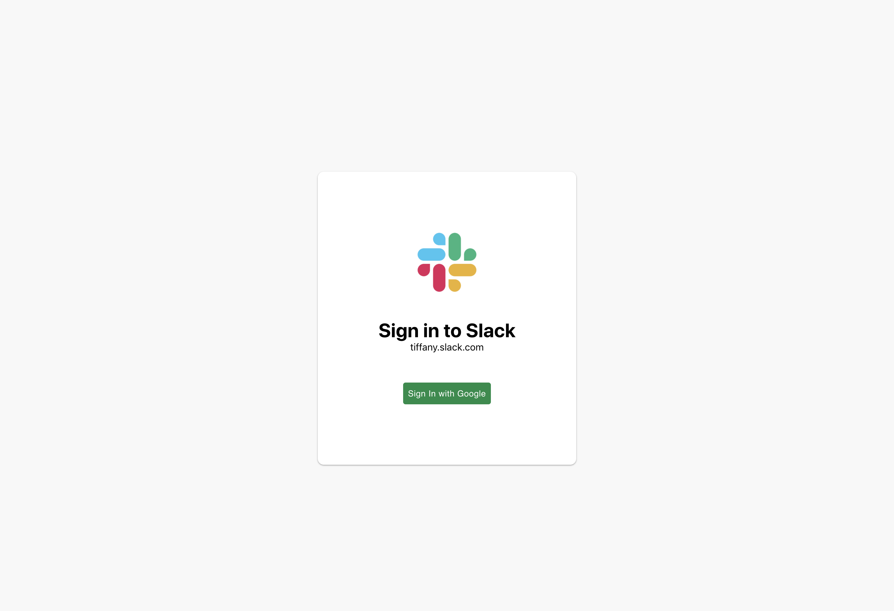
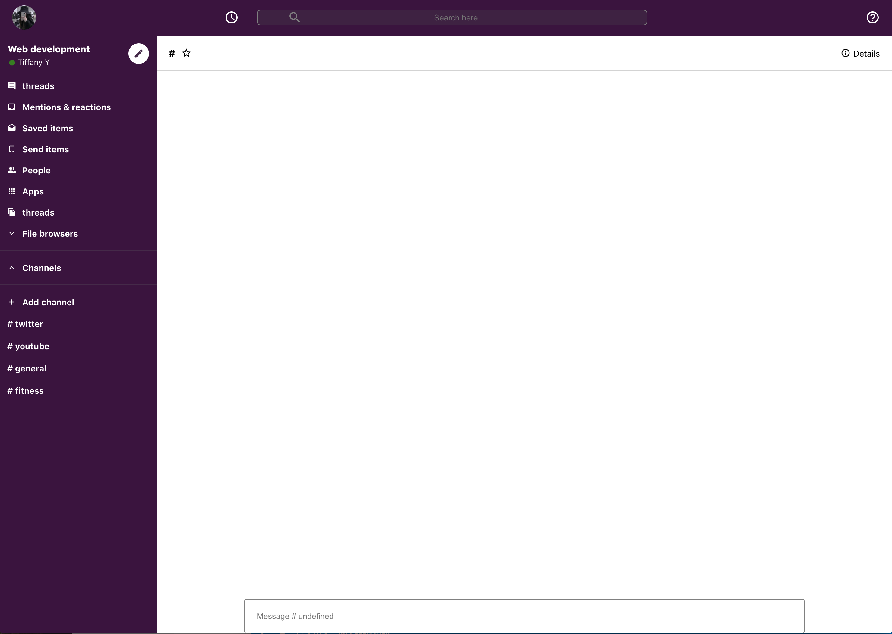

# slack-clone
A slack clone using React

Functionalities:
- Create chat channels and any one can join that channel
- Real time chat with users
- Login with Google Authentication
- Real-time database (Firebase) 

Languages, frameworks, libraries and tools

React, Javascript, HTML/CSS, Firebase, Material UI

To Run the App:

Inside slack-clone folder: 
npm i

/images/Screen Shot 2020-09-21 at 6.31.45 AM.png 

